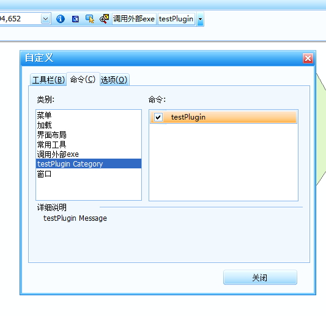

#添加自定义工具
##一. 新建自定义功能
###1. 添加项目
在vs中添新建一个类库项目(此处已`testPlugin`为例)，项目的位置放到相应的本地目录下，便于管理，例如我的这个测试代码则放到`drinkingWaterSource\测试代码\ws\`下。目标框架暂时为.NET Framework 3.5。

###2. 添加引用
需要添加的引用有YiMaGIS、DevExpress、ArcGIS三个相关的类库，其中必须添加的有CommonUtility.dll、FrameworkCore.dll、ESRI.ArcGIS.SystemUI
###3. 实现接口
从给的示例代码看`ICommand`接口必须实现、如果要添加到`工具栏`/`菜单栏`上必须实现`IBarItem`接口，如果需要与地图交互则必须实现`ITool`接口。
1. ICommand接口(namespace ESRI.ArcGIS.SystemUI)，ArcGIS中的command，即与地图控件(mapControl)不交互
```C#
        #region ICommand
        private ISIGISApp m_pApp;

        public int Bitmap
        {
            get { return 0; }
        }

        public string Caption
        {
            get { return "testPlugin"; }
        }

        public string Category
        {
            get { return "testPlugin Category"; }
        }

        public bool Checked
        {
            get { return true; }
        }

        public bool Enabled
        {
            get { return true; }
        }

        public int HelpContextID
        {
            get { return 0; }
        }

        public string HelpFile
        {
            get { return ""; }
        }

        public string Message
        {
            get { return "testPlugin Message"; }
        }

        public string Name
        {
            get { return "testPlugin Name"; }
        }

        public void OnClick()
        {
            MessageBox.Show("这是一个插件测试");
        }

        public void OnCreate(object Hook)
        {
            //改接口必须实现，否则无法正确加载该dll，从而导致系统崩溃
            if (Hook is ISIGISApp)
            {
                m_pApp = (ISIGISApp)Hook;
            }
        }

        public string Tooltip
        {
            get { return "testPlugin Tooltip"; }
        }
        #endregion
```
2. IBarItem接口(namespace YiMaGIS.Framework.Core)，改接口主要负责挂载命令到YiMaGIS主界面上。
```C#
        #region IBarItem
        public int GroupIndex
        {
            get { return 1; }
        }

        public BarItemKind Kind
        {
            get { return BarItemKind.BarCheckItem; }
        }

        public string ShortCut
        {
            get { return ""; }
        }
        #endregion
```

3.ITool接口(namespace ESRI.ArcGIS.SystemUI)，负责地图交互，下面是平移的代码
```C#
        #region ITool 成员

        public int Cursor
        {
            get
            {
                return m_pControlsMapZoomPanTool.Cursor;
            }
        }

        public bool Deactivate()
        {

            return m_pControlsMapZoomPanTool.Deactivate();
        }

        public bool OnContextMenu(int x, int y)
        {
            return true;
        }

        public void OnDblClick()
        {
            if (m_pControlsMapZoomPanCommand.Enabled)
                m_pControlsMapZoomPanTool.OnDblClick();
        }

        public void OnKeyDown(int keyCode, int shift)
        {
            if (m_pControlsMapZoomPanCommand.Enabled)
                m_pControlsMapZoomPanTool.OnKeyUp(keyCode, shift);
        }

        public void OnKeyUp(int keyCode, int shift)
        {
            if (m_pControlsMapZoomPanCommand.Enabled)
                m_pControlsMapZoomPanTool.OnKeyUp(keyCode, shift);

        }

        public void OnMouseDown(int button, int shift, int x, int y)
        {
            if (m_pControlsMapZoomPanCommand.Enabled)
                m_pControlsMapZoomPanTool.OnMouseDown(button, shift, x, y);
        }

        public void OnMouseMove(int button, int shift, int x, int y)
        {
            if (m_pControlsMapZoomPanCommand.Enabled)
                m_pControlsMapZoomPanTool.OnMouseMove(button, shift, x, y);
        }

        public void OnMouseUp(int button, int shift, int x, int y)
        {
            if (m_pControlsMapZoomPanCommand.Enabled)
                m_pControlsMapZoomPanTool.OnMouseUp(button, shift, x, y);
        }

        public void Refresh(int hdc)
        {
            m_pControlsMapZoomPanTool.Refresh(hdc);
        }

        #endregion
```
##二. 添加自定义功能到YiMaGIS
###1. 修改配置文件
打开`YiMaGIS.exe.config`(xml格式)文件，找到`SystemCommands`节点，在其中添加一个子项即可，示例如下：
```xml
  ...
  <SystemCommands>
    <Commands>
      <ClearCommand />
      <AddCommand AssemblyPath="LoadMxd.dll" />
      <AddCommand AssemblyPath="CustomFrame.dll" />
      <AddCommand AssemblyPath="Tools.dll" />
      <AddCommand AssemblyPath="CallExe.dll" />
      <AddCommand AssemblyPath="testPlugin.dll" />
    </Commands>
  </SystemCommands>
  ...
```
###2. 将生成的`testPlugin.dll`拷贝到`YiMaGIS.exe`同级目录即可。
